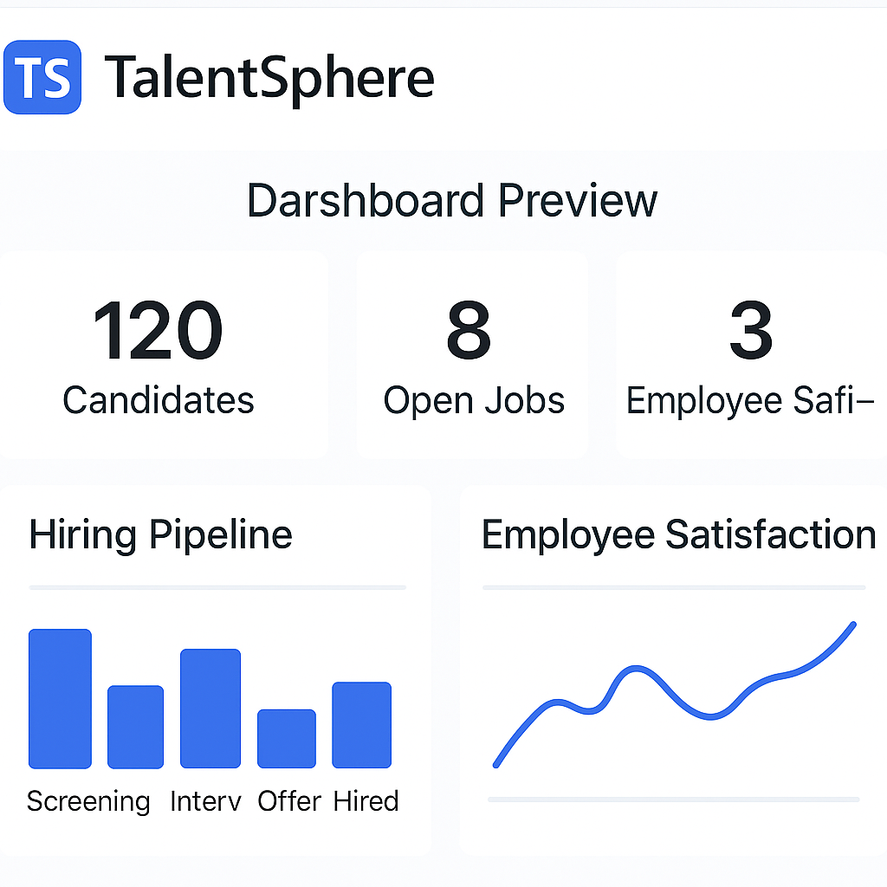
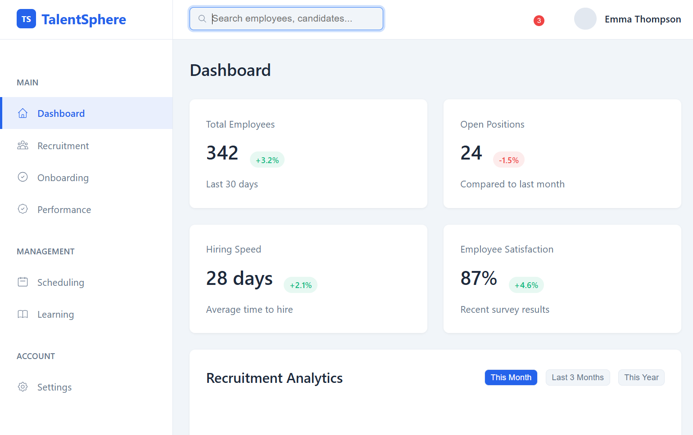

# TalentSphere

TalentSphere is a comprehensive talent management platform designed to streamline HR processes, enhance recruitment efficiency, and improve employee engagement. It provides a centralized dashboard for managing recruitment, onboarding, performance tracking, and more.

---

## Table of Contents

1. [Overview](#overview)
2. [Features](#features)
3. [Project Structure](#project-structure)
4. [Installation](#installation)
5. [Usage](#usage)
6. [Dashboard Details](#dashboard-details)
7. [API Endpoints](#api-endpoints)
8. [Flowcharts](#flowcharts)
9. [Market Impact](#market-impact)
10. [Technologies Used](#technologies-used)
11. [Screenshots](#screenshots)
12. [License](#license)
13. [Contact](#contact)

---

## Overview

TalentSphere is built to address the challenges faced by HR teams in modern organizations. It simplifies recruitment, onboarding, and employee management while providing actionable insights through a user-friendly dashboard.

---

## Features

| Feature                | Description                                                                 |
|------------------------|-----------------------------------------------------------------------------|
| **Dashboard**          | Real-time analytics and insights into HR metrics.                         |
| **Recruitment**        | Manage job postings, candidate pipelines, and hiring processes.           |
| **Onboarding**         | Streamlined onboarding with checklists and timelines.                     |
| **Performance Tracking** | Monitor employee performance and satisfaction.                           |
| **Settings**           | Customize account preferences, notifications, and integrations.           |

---

## Project Structure

```
TalentSphere/
├── models/
│   └── User.js          # Mongoose model for user data
├── public/
│   ├── dashboard.html   # Main dashboard
│   ├── recruitment.html # Recruitment page
│   ├── onboarding.html  # Onboarding page
│   ├── settings.html    # User settings
│   ├── assets/          # Static assets (images, icons, etc.)
│   └── styles/          # CSS styles
├── server.js            # Backend server
├── package.json         # Dependencies and scripts
└── README.md            # Project documentation
```

---

## Installation

1. Clone the repository:
   ```bash
   git clone https://github.com/your-repo/talentsphere.git
   cd talentsphere
   ```

2. Install dependencies:
   ```bash
   npm install
   ```

3. Start the server:
   ```bash
   npm start
   ```

4. Open `http://localhost:5000` in your browser.

---

## Usage

### Dashboard
- View real-time statistics such as total employees, open positions, and hiring speed.
- Access recruitment analytics and recent activity logs.

### Recruitment
- Manage job postings and candidate pipelines.
- Track application statuses and perform actions like screening or shortlisting.

### Onboarding
- Use checklists and timelines to onboard new employees efficiently.

### Settings
- Customize account preferences, notification settings, and connected apps.

---

## Dashboard Details

The `dashboard.html` file is the core of the TalentSphere platform, providing a user-friendly interface for HR professionals. Below are the key components of the dashboard:

### Sidebar
- **Purpose**: Navigation between different sections like Dashboard, Recruitment, Onboarding, and Settings.
- **Features**:
  - Active state highlighting for the current section.
  - Responsive design with a collapsible sidebar for smaller screens.

### Header
- **Purpose**: Displays search functionality, notifications, and user profile options.
- **Features**:
  - Search bar for quick access to employees and candidates.
  - Notification badge for real-time updates.
  - User menu with profile picture and name.

### Main Content
- **Purpose**: Displays key HR metrics and actionable insights.
- **Features**:
  - **Stats Grid**: Shows metrics like total employees, open positions, hiring speed, and employee satisfaction.
  - **Recruitment Analytics**: Interactive charts for tracking applications and hires over time.
  - **Recent Activity**: A list of recent HR activities like candidate screenings and onboarding completions.
  - **Candidate Pipeline**: A table displaying candidate details, application status, and actions.

### Responsive Design
- The dashboard is fully responsive, adapting to different screen sizes using CSS media queries.
- Sidebar collapses on smaller screens, and the layout adjusts for optimal usability.

### Technologies Used
- **HTML**: Provides the structure for the dashboard.
- **CSS**: Handles styling, including themes, animations, and responsive design.
- **JavaScript**: Adds interactivity, such as toggling the sidebar and filtering data.

---

## API Endpoints

| Endpoint       | Method | Description                     |
|----------------|--------|---------------------------------|
| `/signup`      | POST   | Register a new user.           |
| `/login`       | POST   | Authenticate an existing user. |
| `/recruitment` | GET    | Fetch job postings and candidates. |
| `/recruitment` | POST   | Add a new job posting.         |

---

## Flowcharts

### User Authentication Flow
```plaintext
[User] --> [Signup/Login Form] --> [Server] --> [Database]
```

### Recruitment Process
```plaintext
[Job Posting] --> [Candidate Application] --> [Screening] --> [Shortlisting] --> [Hiring]
```

### Dashboard Data Flow
```plaintext
[Database] --> [Server] --> [Dashboard API] --> [Frontend]
```

---

## Market Impact

### Problem Statement
HR teams often face challenges in managing recruitment, onboarding, and employee engagement due to fragmented tools and lack of centralized data.

### Solution
TalentSphere addresses these challenges by providing:
- A unified platform for all HR operations.
- Real-time analytics to make data-driven decisions.
- Tools to enhance employee satisfaction and retention.

### Market Grasp
- **Target Audience**: Mid-sized to large organizations with dedicated HR teams.
- **Market Size**: The global HR software market is projected to reach $38 billion by 2030.
- **Competitive Edge**: TalentSphere offers a user-friendly interface, customizable features, and seamless integration with existing tools.

---

## Technologies Used

| Technology      | Purpose                                   |
|------------------|-------------------------------------------|
| **HTML/CSS**    | Frontend structure and styling.           |
| **JavaScript**  | Frontend interactivity and logic.         |
| **Node.js**     | Backend server and API development.       |
| **Express.js**  | Web framework for building APIs.          |
| **MongoDB**     | Database for storing user and HR data.    |
| **bcrypt.js**   | Password hashing for secure authentication. |

---

## Screenshots

### Dashboard


### Recruitment


---

## License

This project is licensed under the MIT License. See the [LICENSE](LICENSE) file for details.

---

## Contact

For questions or feedback, please contact [support@talentsphere.com](mailto:support@talentsphere.com).